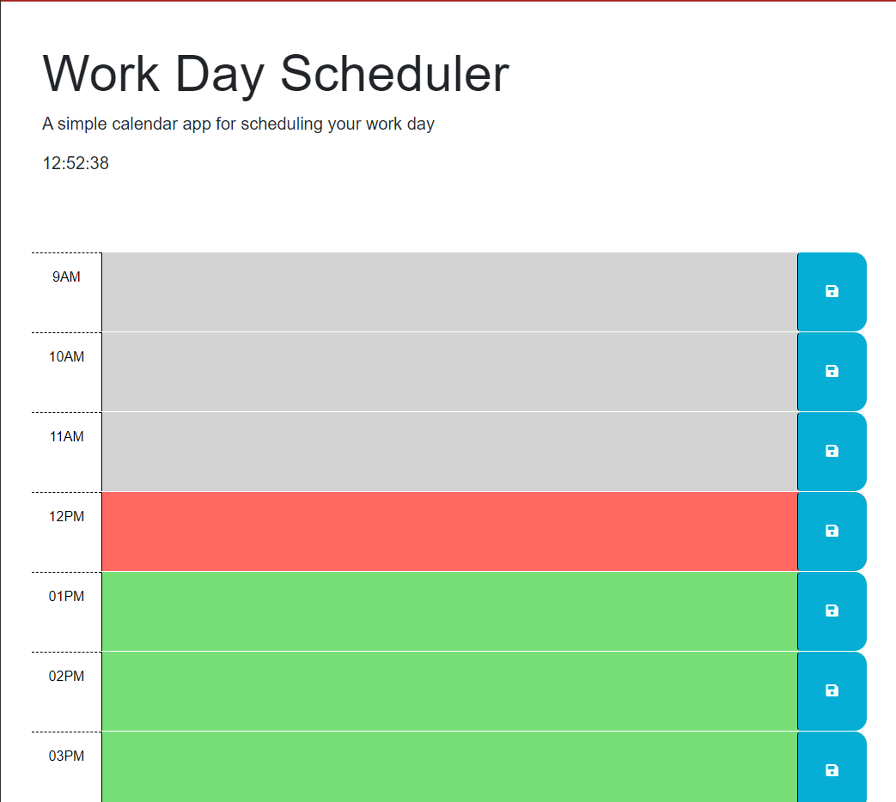

# work_day_scheduler

[Work day scheduler](https://sharktank3800.github.io/work_day_scheduler/)

## Description
**Lets users add important events to a daily planner to manage their time effectively, after opeing the planner your presented with time blocs for standard business hours of 9am to 5pm. Each time block is color-coded indicating past, present, future tense, clicking into the time block lets users enter an event, clicking the save button for that time clock saves that event in local storage, saved events persist even after user refreshes the page.**

## Usage

## License

**Under MIT licence**
